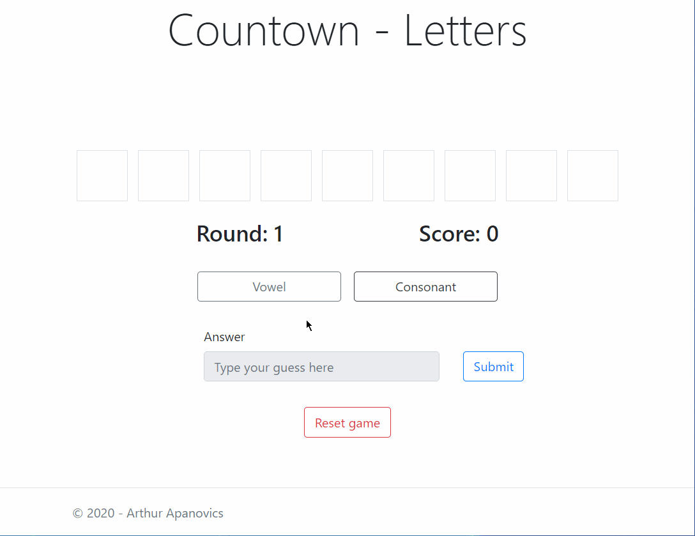

### Coding challenge for OnSide

Create a C# solution that plays a 1-player version of the Countdown letters game rounds.

**Requirements:** 
* UI can be whatever you like (Console, WinForms, Web) - but keep it simple 
* The program should allow the user to choose Consonants / Vowels 
* The program should automatically identify the longest possible English word in each round and score the appropriate number of points for the round. 
* The program should allow for 4 rounds to be played 
* The program should keep track of the total points scored

### Result

